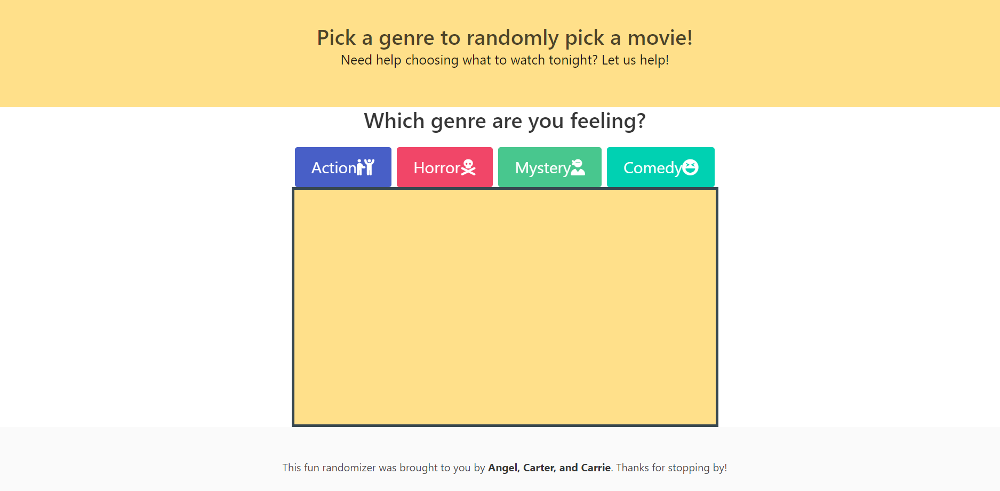
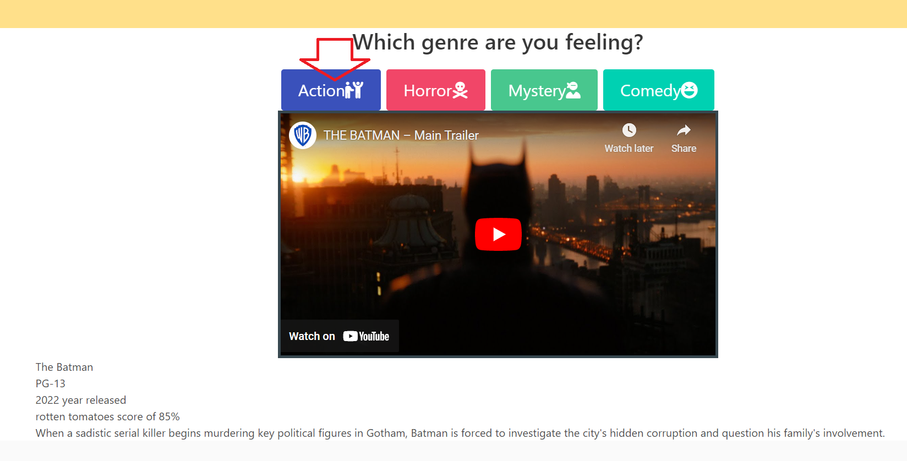

# Movie Randomizer

## Description

This project is a solution to today's greatest threat, not knowing what movie to watch. This project will allow a user to select one of four genres and randomly generate a movie residing within the genre. In addition to displaying information about the movie, a trailer will also automatically be searched for on YouTube. Our team learned a lot about the use of APIs throughout the process and hope that our new skills are appropriately demonstrated in the final product.

## Installation

To use the product navigate to the deployed webpage at https://carterblake.github.io/Movie-Randomizer/

## Usage

## Credits

A group collaboration with:
https://github.com/angel-asp
https://github.com/CarrieLJ
https://github.com/carterblake

Third-Party Assets:
https://developers.google.com/youtube/v3
https://bulma.io/
https://www.omdbapi.com/

Tutorials followed:
https://www.youtube.com/watch?v=EAyo3_zJj5c&t=768s
https://developer.mozilla.org/en-US/docs/Web/API/Element/remove
https://www.youtube.com/watch?v=ouI1_tZ1yK4

## License

see license file
